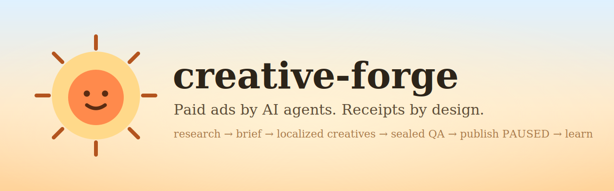
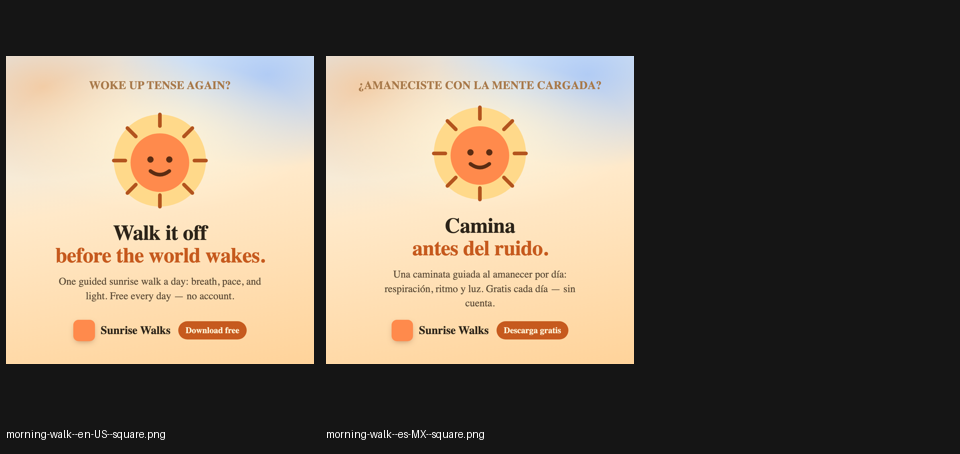
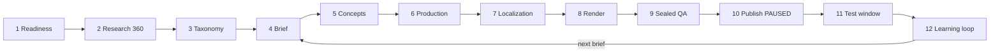

<h1 align="center">creative-forge</h1>

<div align="center">
  
</div>

<h3 align="center">
  The agent-driven paid-creative workflow that refuses to lie.<br>
  Traceable evidence &rarr; original or adapted creatives &rarr; sealed QA &rarr; ads requested PAUSED and live-verified PAUSED &mdash; with receipts at every step.
</h3>

<p align="center">
  <a href="https://github.com/davidmosiah/creative-forge/releases/latest"></a>
  <a href="https://github.com/davidmosiah/creative-forge/actions/workflows/ci.yml"></a>
  <a href="LICENSE"></a>
  <a href="#-quality-bar"></a>
  <a href="https://www.remotion.dev"></a>
</p>

<p align="center">
  <strong>What is this?</strong> A production creative pipeline where <strong>AI agents do the creative and strategic work</strong> (research, hypotheses, copy, scenes, QA judgment) and <strong>fail-closed validators enforce the truth</strong> (provenance, rights, hashes, timing, PAUSED-only publishing). The human holds the only keys that matter: <strong>activation, budget, spend</strong>.
</p>

---

## Front door

| | |
|---|---|
| 🏃 **Run it in 3 commands** | [Quick start](#-quick-start) — the fictional demo app renders real, QA'd creatives out of the box |
| 🧭 **Understand the design** | [Why fail-closed?](#-why-fail-closed) · [The 12-stage loop](#-the-12-stage-loop) |
| 🧾 **See the receipts** | [What "proof" means here](#-the-receipts) — capability, readiness, PAUSED readback envelopes |
| 🛠 **Onboard your real app** | [docs/GETTING-STARTED.md](docs/GETTING-STARTED.md) — from `apps/your-app.yaml` to your first sealed batch |
| 📖 **Operator handbook** | [PLAYBOOK.md](PLAYBOOK.md) — the full operating contract, stage by stage |

---

## 🎬 See it run

```bash
python3 scripts/forge.py build --app sunrise-demo --batch-id demo-001 --jobs 2
```

<div align="center">
  
</div>

That's the **actual QA contact sheet** the demo produces on a fresh clone: one concept, two markets (`en-US`, `es-MX`), transcreated copy (not translated), brand palette from config, safe zones checked, every PNG hashed and sealed. No accounts, no credentials, no network writes.

---

## 🚀 Quick start

### Install the package from the repository

```bash
git clone https://github.com/davidmosiah/creative-forge.git
pip install ./creative-forge

# Demo workspace is bundled in the wheel — no clone required for image preflight/build
creative-forge preflight --app sunrise-demo
creative-forge build --app sunrise-demo --batch-id demo-001 --jobs 2
```

The wheel quick start is exercised in CI. PyPI publication is still pending
Trusted Publisher configuration, so this README does not claim a live PyPI
package before that external state exists.

On macOS, full Chrome launches are serialized by default because concurrent
ephemeral profiles are unreliable under load. `--jobs` still controls other
platforms; an operator may explicitly override the cap with
`CREATIVE_FORGE_CHROME_MAX_PARALLEL` after verifying the local Chrome build.

Prefer a checkout? Clone the repo (needed for Remotion video) and either work
from the tree or point the CLI at it:

```bash
git clone https://github.com/davidmosiah/creative-forge.git
cd creative-forge
python3 -m venv .venv && . .venv/bin/activate
pip install -e .
# optional: export CREATIVE_FORGE_ROOT="$PWD"
```

### From a fresh clone (full video stack)

```bash
python3 -m venv .venv && . .venv/bin/activate
pip install -r requirements.txt
cd remotion && npm ci --ignore-scripts && npm run typecheck && cd ..

# 1. Validate everything (research, claims, rights, locales, audiences)
python3 scripts/forge.py preflight --app sunrise-demo

# 2. Render the creative matrix + QA report + contact sheets
python3 scripts/forge.py build --app sunrise-demo --batch-id demo-001 --jobs 2

# 3. Use the contact sheet as an index, open every original PNG, and write
#    one note per artifact_key in qa-review.json before sealing approval.
python3 scripts/qa.py approve --report qa/sunrise-demo/demo-001/report.json \
  --reviewer you --review-file qa-review.json

# 4. Static dashboard of everything the sealed artifacts prove
python3 scripts/dashboard.py --app sunrise-demo --open

# Bonus: a 15s mute-safe video, rendered by Remotion with agent-authored scenes
python3 scripts/forge.py build-video --app sunrise-demo \
  --recipe morning-ritual --locale en-US --batch-id demo-001
```

`sunrise-demo` is a **fictional product with fictional research** so the whole
pipeline runs end to end with zero real data. Every fictional file says so.

See also: [CHANGELOG.md](CHANGELOG.md) · [Contributing](CONTRIBUTING.md)

---

## 🧨 Why fail-closed?

Everyone building with agents hits the same wall: the agent says
*"campaign published!"* — and nothing was published. It reports metrics that
don't exist. It would happily spend your budget at 3am.

creative-forge inverts the trust model. **Agents author; validators verify;
humans authorize.**

| The agent decides | The validators enforce | Only a human may |
|---|---|---|
| research angles & hypotheses | provenance: every creative cites recorded research | activate an ad |
| copy, scenes, pacing, cultural fit | rights: source, hash, commercial + derivative scope | set or change budget |
| what a metric result *means* | schema, char limits, safe zones, encoding, timing | spend money |
| QA judgment (it must actually look) | sealed approvals — one changed byte voids them | waive a physical check |

Three rules with no exceptions:

1. **Truthful lineage, creative latitude.** Every concept declares a traceable
   `lineage_ref`. A recipe may separately declare an `execution_ref` for a
   format or audiovisual pattern—even from another lineage. Structural matching
   applies only when that execution reference is `competitor_pattern`;
   otherwise the agent is free to invent hook, composition, copy, scenes,
   pacing, format, and visual language. Validators never score taste.
2. **A local receipt never proves external state.** Publishing needs a fresh
   capability receipt, a live destination readback, and a byte-canonical
   `PAUSED` readback envelope from the platform. An `ACTIVE` provider response
   cannot be masked by local bookkeeping.
3. **Honest metrics.** Missing data is `insufficient_data`, never zero. ROAS
   is never invented. Video results carry hook/hold rates so a losing ad tells
   you *where* it lost (the first 3 seconds vs. the body).

---

## 🔁 The 12-stage loop



Every stage has a validator; every hand-off is an artifact on disk you can
audit later. The full contract lives in [PLAYBOOK.md](PLAYBOOK.md).

---

## 🧾 The receipts

The publish path is where agent pipelines usually lie, so it's the most
defended surface here. Creating one ad requires, in order:

1. **Capability receipt** (&lt; 60 min old) naming the real discovered platform
   tools — including a strictly read-only tool, never a create/update/delete
   or other write operation.
2. **Readiness receipts** from live checks: the store destination is up, the
   platform has received app events, attribution is mapped. Raw responses are
   stored with their sha256.
3. A **manifest** bound to the sealed QA matrix — one ad per concept, capped
   per ad set, `PAUSED` hardcoded, `activation_allowed: false`.
4. A **byte-canonical readback envelope** per ad, cross-binding provider, tool,
   timestamp, `PAUSED`, all platform IDs and the artifact hash:

```json
{"binding": {"ad_id": "…", "artifact_sha256": "…", "status": "PAUSED", "…": "…"},
 "provider_response": {"id": "…", "status": "PAUSED", "…": "…"},
 "schema": "creative-forge/meta-ad-readback@1", "tool": "…", "observed_at": "…"}
```

`scripts/publish.py verify-receipt` re-validates the whole chain — and even
then, a verified receipt only proves the *audit record*: a `DONE` claim
requires the live readback observed in the current run.

---

## 🗂 What's inside

| Piece | What it does |
|---|---|
| `scripts/forge.py` | `preflight` / `build` / `build-video` / `prepare-publish` |
| `scripts/qa.py` · `video_qa.py` | sealed QA: hashes, dimensions, safe zones, per-artifact visual approval |
| `scripts/research.py` · `video_mining.py` | research contracts — structure only, never media reuse |
| `scripts/audiences.py` | fail-closed audience plans (no sensitive-interest targeting, ever) |
| `scripts/publish.py` | PAUSED-only manifests, capability receipts, canonical readback envelopes |
| `scripts/experiments.py` | learning loop: metrics provenance, hook/hold rates, next-brief binding |
| `scripts/host_assets.py` | content-hash static hosting + live byte-for-byte URL verification |
| `scripts/dashboard.py` | static evidence viewer — reads sealed artifacts only, invents nothing |
| `remotion/` | generic video composition (story · portrait · square), mute-safe by contract |
| `templates/image/*` | HTML creative templates with per-field char limits and declared safe zones |
| `apps/sunrise-demo.yaml` | the fictional demo app — copy its shape to onboard a real one |

## ✅ Quality bar

- **321 tests** (`python3 -m unittest discover -s tests -v`) — validators, receipts, hardening, contracts
- **Typechecked video** (`cd remotion && npm run typecheck`)
- **CI** runs the full suite *plus a real Remotion render* with sealed QA prep
- Fictional demo data only; the repo ships **zero** real product or ad-account data

## 🧭 Design rules that will not change

1. Competitors' **public** signals only; their art, media, voices and copy are never reused.
2. No religious or sensitive-interest ad targeting — context lives in the creative, language and country.
3. Agents author freely; validators enforce truth/rights/state; humans authorize activation/budget/spend.
4. Every bound on coverage is logged — silent truncation is treated as lying.

## 🤝 Contributing & security

PRs welcome — read [CONTRIBUTING.md](CONTRIBUTING.md) first (rule #1: never
weaken a fail-closed gate). Vulnerabilities: use GitHub's private vulnerability
reporting — see [SECURITY.md](SECURITY.md).

## 📄 License

[AGPL-3.0](LICENSE). Run a modified version as a service? Share your changes.
